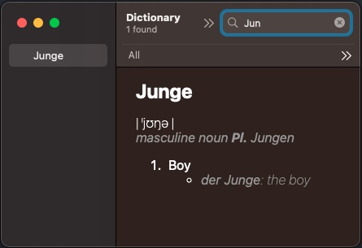

# GermanDictionary
Kevin Chau's German Dictionary



This project builds a bilingual German-English and English-German dictionary for macOS's built-in `Dictionary` application.

To build:
```
cd dictionary
make all install
```

This should convert the dictionary entries defined in the XML file into an Apple dictionary format, and then place it in the ~/Library/Dictionaries folder.

All you have to do after that is open `Dictionary.app`, go to menu `Dictionary > Settings` or shortcut `cmd + ,`, then check the box for `Kevin Chau's German-English Dictionary`. 

You'll need to restart `Dictionary.app` every time you rebuild the dictionary, but you do not need to re-add the dictionary.

# Apple Developer Documentation
https://developer.apple.com/library/archive/documentation/UserExperience/Conceptual/DictionaryServicesProgGuide/Introduction/Introduction.html